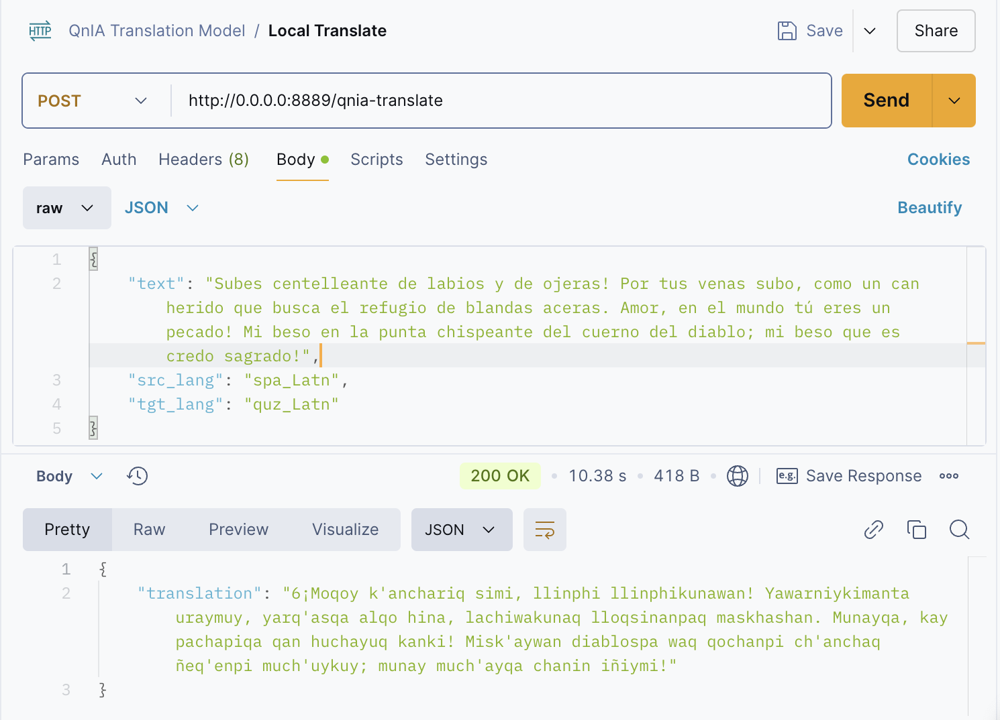

# Finetuning nllb model for translating a new language

This repo contains the notebook training and the implementation of a fine-tuned model of [facebook/nllb-200-distilled-600M](https://huggingface.co/facebook/nllb-200-distilled-600M) to handle Cuzco Quechua, a new language.

All of this process is inspired by this [Medium Article](https://cointegrated.medium.com/how-to-fine-tune-a-nllb-200-model-for-translating-a-new-language-a37fc706b865) by David Dale.

> [!CAUTION]
> The fine tuning processing time is linked to the number of training steps. I used 10k steps and it lasted 2 hours and a half. In the original script, it takes 57k steps, which means +35 hours.

## Pre-requisites
- Hugging Face account and API token
- A dataset with source and target language uploaded in Hugging Face (+10k rows recommended)
- GPU Machine (Tesla T4 recommended)

> [!NOTE]
> I ran this in an Azure Instance Tesla T4 with these characteristics: Standard_NC16as_T4_v3 (16 cores, 110 GB RAM, 352 GB disk).

## Project Structure
- `notebooks` : Where the Jupyter Notebook with the finetuning process is located
- `app.py` : The testing of the model after uploadind it to Hugging Face
- `endpoint.py` : Converting the process to an API using FastAPI

## Final Translator Model
Check my fine-tuned model [here](https://huggingface.co/pollitoconpapass/QnIA-translation-model).

### endpoint.py Result

